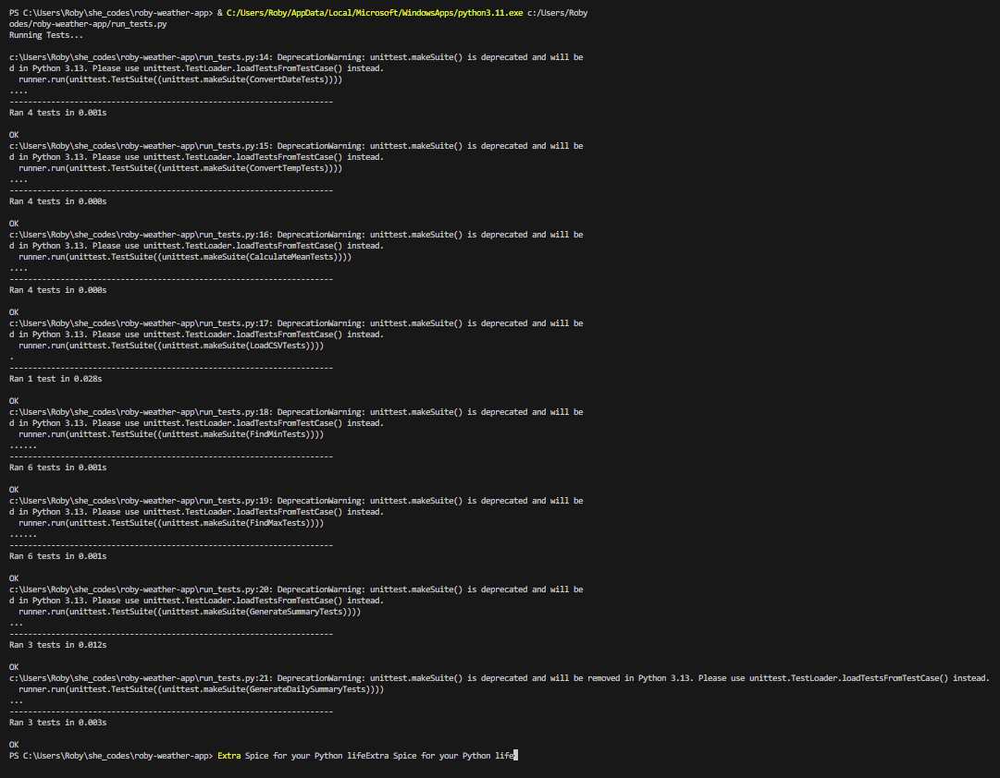

# roby-weather-app
This app processes csv files containing data about the weather and converts them into meaningful text-based summaries.

## Work details:
Needed to write functions to manipuate/convert/calculate data from existing files and return the dat ain a readable format.

### Test Results:
